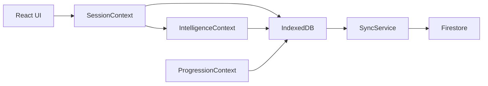

# My-Shinobi Full Documentation (Deep Dive) generated on 2nd Feb 2026

This document is a **comprehensive, copy-paste friendly** guide to the `my-shinobi` repo, covering setup, architecture, data flows, learning engine internals, curriculum and question systems, offline + cloud sync design, admin tooling, testing, and extension patterns.

Repo: https://github.com/saideep-g/my-shinobi

---

## Table of Contents

- [1. What is My-Shinobi](#1-what-is-my-shinobi)
- [2. Tech Stack](#2-tech-stack)
- [3. Quick Start](#3-quick-start)
- [4. Environment Variables](#4-environment-variables)
- [5. Key Scripts](#5-key-scripts)
- [6. Project Structure](#6-project-structure)
- [7. Runtime Architecture](#7-runtime-architecture)
- [8. Authentication & Roles](#8-authentication--roles)
- [9. Theme System](#9-theme-system)
- [10. Offline-First Data Layer](#10-offline-first-data-layer)
  - [10.1 IndexedDB Schema](#101-indexeddb-schema)
  - [10.2 DB Adapter](#102-db-adapter)
- [11. Cloud Sync](#11-cloud-sync)
- [12. Learning Engine](#12-learning-engine)
  - [12.1 Bayesian Mastery Engine (BKT)](#121-bayesian-mastery-engine-bkt)
  - [12.2 Selection Engine](#122-selection-engine)
  - [12.3 Session Engine](#123-session-engine)
- [13. Curriculum & Bundles](#13-curriculum--bundles)
- [14. Question System](#14-question-system)
  - [14.1 Templates & Registry](#141-templates--registry)
  - [14.2 Question Renderer](#142-question-renderer)
  - [14.3 Adding a New Question Type](#143-adding-a-new-question-type)
  - [14.4 Hashing / Dedup](#144-hashing--dedup)
- [15. Assessment Domain](#15-assessment-domain)
  - [15.1 Session Logs](#151-session-logs)
  - [15.2 History Vault](#152-history-vault)
- [16. Multiplication Tables (Dynamic Subject)](#16-multiplication-tables-dynamic-subject)
  - [16.1 Generation and Storage](#161-generation-and-storage)
  - [16.2 Dashboards](#162-dashboards)
  - [16.3 Tables Ledger](#163-tables-ledger)
- [17. Progression System (XP / Levels / Streaks)](#17-progression-system-xp--levels--streaks)
- [18. Admin Workbench](#18-admin-workbench)
- [19. Routing Map](#19-routing-map)
- [20. Data Models](#20-data-models)
- [21. Common Workflows](#21-common-workflows)
- [22. Testing](#22-testing)
- [23. Build / Deploy](#23-build--deploy)
- [24. Troubleshooting](#24-troubleshooting)
- [25. Extension Patterns & Design Notes](#25-extension-patterns--design-notes)

---

## 1. What is My-Shinobi

**My-Shinobi** is an adaptive learning app with an **offline-first core**:
- Student progress is stored locally in **IndexedDB**.
- Students can practice sessions (quests) with an adaptive engine.
- Progress is optionally synced to **Firestore** in atomic batches.
- Curriculum is modeled as structured bundles with **atoms** (skills / micro-concepts).
- A question system renders multiple template types (e.g., MCQ, sorting, math-table).
- Multiplication tables are treated as a **dynamic subject** (generated at runtime).

The platform is designed to be:
- **Resilient offline**
- **Fast** (local read/write)
- **Extensible** (new templates, bundles, dashboards)

---

## 2. Tech Stack

Frontend:
- **React 19**
- **TypeScript**
- **Vite**
- **React Router v7**

UI:
- **TailwindCSS**
- `clsx`, `tailwind-merge`
- `lucide-react` icons

Persistence:
- **IndexedDB** via `idb`

Cloud:
- **Firebase Auth**
- **Firestore**

Testing:
- **Vitest** (unit)
- **Playwright** (E2E)

---

## 3. Quick Start

```bash
git clone https://github.com/saideep-g/my-shinobi.git
cd my-shinobi
npm install
npm run dev
```

Open the dev server URL printed by Vite.

---

## 4. Environment Variables

My-Shinobi uses `import.meta.env.VITE_*` variables (Vite convention).

Create `.env` in repo root:

```env
VITE_FIREBASE_API_KEY=...
VITE_FIREBASE_AUTH_DOMAIN=...
VITE_FIREBASE_PROJECT_ID=...
VITE_FIREBASE_STORAGE_BUCKET=...
VITE_FIREBASE_MESSAGING_SENDER_ID=...
VITE_FIREBASE_APP_ID=...

# Optional: where static assets might live (if used by your components/services)
VITE_ASSET_BASE_URL=
```

Notes:
- Firebase config is loaded in `src/core/database/firebase.ts`.
- If these are missing, auth + sync will fail and you may get blank screens or “stuck loading”.

---

## 5. Key Scripts

From `package.json`:

- `npm run dev`: start Vite dev server
- `npm run build`: TypeScript build + Vite production build
- `npm run preview`: preview production build locally
- `npm run lint`: ESLint
- `npm run test` / `npm run test:unit`: Vitest unit tests
- `npm run test:e2e`: Playwright tests
- `npm run ship-it`: automation script (commonly used as a preflight)

---

## 6. Project Structure

High-level structure (feature-based):

```
src/
├── core/
│   ├── auth/         # AuthContext + guards
│   ├── database/     # IndexedDB config + Firebase init + adapter
│   ├── engine/       # mastery, selection, progression, session runtime
│   ├── theme/        # ThemeContext (light/dark)
│   └── media/        # Sensory feedback (sounds/vibration etc)
├── features/
│   ├── admin/        # Admin workbench UI
│   ├── assessment/   # quest UI, session storage/logging, history
│   ├── auth/         # login UI
│   ├── curriculum/   # bundles + grade content + dynamic generators
│   ├── progression/  # XP/levels, subject dashboards, tables parity
│   └── questions/    # question templates + registry + renderer
├── services/
│   ├── db/           # Firestore path helpers
│   ├── sync/         # syncing local → cloud
│   └── validation/   # hashing, content validation utilities
└── types/            # shared types (bundles, questions, progression, assessment)
```

Build config:
- `vite.config.ts` defines aliases:
  - `@` → `src/`
  - `@core` → `src/core`
  - `@features` → `src/features`
  - `@shared` → `src/shared`
  - `@services` → `src/services`
  - `@layouts` → `src/layouts`

---

## 7. Runtime Architecture

### Provider chain

The app bootstraps multiple “global brains” in `src/App.tsx`:

- Theme provider
- Auth provider (Firebase identity + Firestore profile)
- Intelligence provider (Bayesian mastery map)
- Progression provider (XP, levels, streaks, sync)
- Mission provider (daily goals / progress)
- Session provider (active learning session engine)
- Router (navigation + guards)

### Mental model
Think of it as:
- **Auth** tells you *who the user is*
- **Intelligence** tells you *what the user knows*
- **Progression** tells you *what the user earned and configured*
- **Session** tells you *what the user is doing right now*
- **Router** decides *what screen to show*

---

## 8. Authentication & Roles

Auth lives in `src/core/auth/AuthContext.tsx`.

Key behaviors:
- Listens to Firebase Auth via `onAuthStateChanged`.
- Fetches the student profile doc from Firestore on login.
- If missing, auto-initializes a Firestore profile with defaults.

Default profile fields typically include:
- `uid`
- `email`
- `displayName`
- `role` (default: `STUDENT`)
- `grade` (default: 7)
- `preferredLayout` (e.g., `mobile-quest`)
- `connections` array

### Guards
Routing is protected with:
- `ProtectedRoute` (must be logged in)
- `RoleGuard` (must have allowed roles)

Role examples:
- Student domain: `STUDENT`, `ADMIN`
- Admin domain: `ADMIN` only

---

## 9. Theme System

Theme is managed by `src/core/theme/ThemeContext.tsx`.

Features:
- Light/Dark mode
- Stored in `localStorage` key `shinobi_theme`
- Applies `.light` or `.dark` class to `<html>`

Tailwind is configured for class-based dark mode:
- `tailwind.config.js`: `darkMode: 'class'`

---

## 10. Offline-First Data Layer

My-Shinobi uses IndexedDB as the **local source of truth** for:
- stats
- mastery map
- sessions (with logs)
- question library caching (where applicable)
- subjects (curriculum)

### 10.1 IndexedDB Schema

Defined in `src/core/database/idb.ts`.

Database:
- `DB_NAME = 'my_shinobi_db'`
- `DB_VERSION = 2`

Stores:
- `subjects`
- `questions` (indexes: `by-hash`, `by-atom`)
- `sessions` (indexes: `by-status`, `by-user`)
- `stats`
- `mastery`

Important: the upgrade path creates/patches indexes when old versions exist.

### 10.2 DB Adapter

`src/core/database/adapter.ts` provides a consistent API:
- `get(store, id)`
- `getAll(store)`
- `put(store, data)`
- `delete(store, id)`

Specialized helpers:
- `getQuestionByHash(hash)`
- `getQuestionsByAtom(atomId)`
- session queries like `getUnsyncedSessions(userId)`

---

## 11. Cloud Sync

Cloud sync is optional and designed to be safe and atomic.

Service:
- `src/services/sync/syncService.ts`

### What it syncs
1. Student stats (`students/{uid}`)
2. Mastery map (`students/{uid}/intelligence/mastery`)
3. Completed sessions (`students/{uid}/sessions/{sessionId}`)

### How it syncs
- Uses Firestore **writeBatch** to commit everything atomically.
- Uses “Last write wins” semantics for stats.
- Marks local sessions as `SYNCED` after successful commit.

Firestore paths are standardized in:
- `src/services/db/firestore.ts`

---

## 12. Learning Engine

My-Shinobi’s learning engine is composed of three main parts:
1. Bayesian mastery map update (knowledge estimation)
2. Selection engine (chooses next best question)
3. Session engine (runs the interactive loop + logging)

### 12.1 Bayesian Mastery Engine (BKT)

File: `src/core/engine/bayesian.ts`

Implements Bayesian Knowledge Tracing (BKT):
- guess probability `pG`
- slip probability `pS`
- learning transition `pT`

Default:
- `pG = 0.20`
- `pS = 0.10`
- `pT = 0.15`
Mastery is clamped to `[0.01, 0.99]`.

Mastery is tracked in `MasteryMap`:
- key = atomId OR contentHash
- value = probability (0..1)

### 12.2 Selection Engine

File: `src/core/engine/selection.ts`

Core logic:
1. Build set of **unlocked atoms**
   - atom status must be `LIVE`
   - prerequisites must be satisfied (mastery > 0.85 per prereq)
   - chapters must be assigned unless bundle is dynamic
2. Identify “priority atom” = lowest mastery unlocked atom
3. If bundle is dynamic (e.g., multiplication tables), use dynamic logic:
   - 70% current stage, 30% review
   - stage injection when accuracy > 90%
   - dynamic generation based on atomId + mastery + streak
4. If bundle is static, choose from `bundle.questions` filtering:
   - `q.atomId === priorityAtom.id`
   - avoid recentQuestionIds

### 12.3 Session Engine

File: `src/core/engine/SessionContext.tsx`

Responsibilities:
- startSession(bundle)
  - creates local session record in IndexedDB
  - selects first question
- submitResponse(isCorrect, duration, timeTakenMs?)
  - sensory feedback (success/error)
  - capture mastery before/after
  - update mastery via IntelligenceContext
  - create log entry, append to local session
  - update tables ledger if atomId starts with `table-`
  - award XP (+ streak update, mission refresh)
  - select next question
  - finalize session at question limit

Design principle:
- **Write-through buffering**: logs are written to IndexedDB immediately, so refreshes/crashes don’t destroy history.

---

## 13. Curriculum & Bundles

Curriculum is packaged into **bundles**.

Registry:
- `src/features/curriculum/data/bundleRegistry.ts`

Bundles include:
- Grade 7 English (with question pool)
- Grade 7 Math (skeleton)
- Multiplication tables (dynamic)

Bundle fields (common):
- `id`, `grade`, `subjectId`, `version`, `lastUpdated`
- `curriculum`:
  - `chapters[]`
  - each chapter has `atoms[]`
- `questions[]` (static pool or empty for dynamic)
- `stats` (counts + supported templates)
- `isDynamic` for dynamic subjects (tables)

Atoms represent micro-skills:
- `id`
- `title`
- `type` (conceptual/procedural/etc)
- `prerequisites[]`
- `status` (LIVE/DRAFT)

---

## 14. Question System

### 14.1 Templates & Registry

Question types are implemented as “templates”.
Examples visible in the repo include:
- math-table
- mcq
- sorting

A template typically includes:
- a React `Component.tsx` renderer
- `manifest.ts` describing data schema, version, scoring, metadata

Templates are registered in:
- `src/features/questions/registry.ts`

### 14.2 Question Renderer

File:
- `src/features/questions/components/QuestionRenderer.tsx`

Responsibility:
- given a `QuestionBase` object:
  - locate the correct template
  - render it with the correct props
  - handle callbacks (submit/next/etc)

The renderer is intentionally generic: templates own their UI/UX.

### 14.3 Adding a New Question Type

Checklist:

1) Create template folder:
```
src/features/questions/types/<templateId>/v1/
```

2) Add:
- `Component.tsx`
- `manifest.ts`

3) Register the template:
- Update `src/features/questions/registry.ts` to map templateId+version → manifest/component.

4) Ensure question objects reference the template:
- `templateId: '<templateId>'`
- `version: 1`
- `data: { ... }` matching your manifest schema

5) Add tests:
- unit tests for scoring/validation
- e2e tests for core interaction

### 14.4 Hashing / Dedup

Static questions can be fingerprinted with a `contentHash` to prevent duplicates.

Hashing example is used in Grade 7 English pool:
- `src/features/curriculum/data/grade-7/english-questions.ts`

The hashing service lives in:
- `src/services/validation/hashing` (repo-specific path)

Concept:
- stable hash enables:
  - dedup checks
  - “fact-level mastery” tracking (contentHash key in mastery map)

---

## 15. Assessment Domain

Assessment domain is the “Quest” experience:
- pick subject
- play a session
- store logs
- show history

Key UI:
- Quest dashboard: `src/features/assessment/components/QuestDashboard`
- Session UI: `src/features/assessment/components/QuestSessionUI.tsx`

### 15.1 Session Logs

Logs are created in:
- `src/features/assessment/services/logService.ts`

Logs are appended to session storage in:
- `src/features/assessment/services/assessmentManager.ts`

Session storage flows:
- start session → create session record
- each answer → append log
- completion → mark session COMPLETED
- sync service later uploads completed sessions

### 15.2 History Vault

History UI typically reads sessions from IndexedDB:
- `src/features/assessment/components/HistoryVault`

---

## 16. Multiplication Tables (Dynamic Subject)

Multiplication tables are special:
- The bundle is dynamic, with atoms for each fact.
- Questions are generated at runtime rather than stored as a huge pool.

Bundle file:
- `src/features/curriculum/data/grade-7/multiplication-tables.ts`

### 16.1 Generation and Storage

Generator:
- `src/features/curriculum/services/tableGenerator.ts`

Key behaviors:
- Generates `QuestionBase` dynamically.
- Uses `Date.now()` in question ID for uniqueness:
  - `dyn-${atomId}-${multiplier}-${Date.now()}`
- Uses stable `contentHash` for fact mastery continuity:
  - e.g. `hash-7x8-fact`
- Can generate variants:
  - FACT (direct)
  - MISSING_MULTIPLIER (fill blank)
  - FULL_TABLE (grid-like)

Storage:
- Generated questions are ephemeral.
- Student progress is stored via:
  - mastery map (per atom and/or per fact hash)
  - sessions/logs
  - tables ledger (in stats, for parity dashboards)

### 16.2 Dashboards

My-Shinobi includes tables dashboards and a subject hub:

- Specialized subject view switch in router: `SpecializedSubjectView` shows a custom dashboard for multiplication tables.
- Table dashboard hub:
  - `src/features/progression/components/TableDashboard.tsx`
- Heatmap:
  - `src/features/progression/components/FluencyHeatmap.tsx`
- Tables mastery dashboard:
  - `src/features/progression/components/TablesMasteryDashboard.tsx`
- Parent analytics:
  - `src/features/progression/components/ParentAnalyticsDashboard.tsx`

### 16.3 Tables Ledger

Tables-specific stats are stored under `StudentStats.tablesConfig`:

From `src/types/progression.ts`:
- `currentPathStage` (which table is being focused)
- `tableStats` per table number:
  - accuracy, avgSpeed, attempts, status
- `factStreaks` per fact atomId
- `personalBests` per fact atomId (best time ms)

Ledger updates happen during session submission:
- `SessionContext` checks if `atomId.startsWith('table-')`
- updates stats using `updateTablesLedger(...)`

---

## 17. Progression System (XP / Levels / Streaks)

Progression is managed by `src/core/engine/ProgressionContext.tsx`.

Tracks:
- powerPoints (XP)
- heroLevel
- streakCount
- lastActiveDate
- activityLog
- grade
- assignedChapterIds
- achievements
- sessionConfig (questions per session, developer mode)

Features:
- write-through to IndexedDB
- manual cloud sync via `saveChangesToCloud`
- achievements scanning via `checkNewAchievements(...)`

---

## 18. Admin Workbench

Admin UI is under `/admin/*`.

Main shell:
- `src/features/admin/components/ContentWorkbench.tsx`

Admin capabilities (at a high level):
- Curriculum management
- Question bank management
- Student management

Route access:
- guarded by `RoleGuard` with `ADMIN` allowed roles only
- defined in `src/AppRouter.tsx`

---

## 19. Routing Map

Router:
- `src/AppRouter.tsx`

Public:
- `/login`

Student domain (wrapped by `UniversalNav`):
- `/` → redirect to preferred layout (`/quest` or `/library`)
- `/quest` → quest dashboard
- `/quest/:subjectId` → subject map OR specialized table dashboard
- `/quest/:subjectId/play` → session player
- `/library` → library dashboard
- `/library/:subjectId` → era view OR specialized table dashboard
- `/profile` → hero profile
- `/history` → history vault

Tables quick routes:
- `/tables` → tables mastery dashboard
- `/tables/practice` → redirects to quest play for tables
- `/tables/parent` → parent analytics

Admin domain:
- `/admin` → redirects to `/admin/curriculum`
- `/admin/curriculum` and `/admin/curriculum/:bundleId`
- `/admin/questions` and `/admin/questions/:bundleId`
- `/admin/students`

Fallback:
- `*` → redirect `/`

---

## 20. Data Models

Key types live in `src/types/`.

### 20.1 MasteryMap
A map of probabilities:

```ts
export interface MasteryMap {
  [atomId: string]: number; // 0..1
}
```

Keys can be:
- atom IDs (concept mastery)
- content hashes (fact mastery)

### 20.2 StudentStats

Stores:
- XP, levels, streaks
- assignment filters
- session configuration
- optional tables config

```ts
tablesConfig?: {
  currentPathStage: number;
  tableStats: Record<number, { accuracy: number; avgSpeed: number; attempts: number; status: 'LOCKED' | 'PRACTICING' | 'MASTERED' }>;
  factStreaks: Record<string, number>;
  personalBests: Record<string, number>;
};
```

### 20.3 QuestionBase (conceptual)
A question generally includes:
- `id`
- `atomId`
- `templateId`
- `version`
- `difficulty`
- `data` (template-specific)
- optional `contentHash` for dedup/mastery

### 20.4 AssessmentSession (conceptual)
A session includes:
- `id`
- `userId`
- `status` (CREATED/COMPLETED/SYNCED)
- `logs[]` (attempt records)

---

## 21. Common Workflows

### 21.1 Add a New Bundle
1. Create bundle file in `src/features/curriculum/data/grade-X/<bundle>.ts`
2. Export as `SubjectBundle`
3. Add it to `BUNDLE_REGISTRY` in `bundleRegistry.ts`
4. Add UI surfaces if needed (subject cards, icons, theme)

### 21.2 Add New Curriculum Atom
1. Add atom to a chapter’s `atoms[]`
2. Set status `LIVE`
3. Add prerequisites if needed
4. Ensure selection engine can unlock it:
   - prereqs mastered > 0.85

### 21.3 Add Static Questions
1. Add to `bundle.questions`
2. Ensure `atomId` matches an atom in curriculum
3. Ensure template exists and is registered
4. Generate `contentHash` to deduplicate and track fact mastery

### 21.4 Add a Dynamic Subject
1. Set `bundle.isDynamic = true`
2. Provide curriculum atoms that represent dynamic items
3. Update selection engine to recognize your dynamic subject and generate questions via a generator service

---

## 22. Testing

### Unit tests (Vitest)
```bash
npm run test
# or
npm run test:unit
```

### E2E tests (Playwright)
```bash
npm run test:e2e
```

### Recommended tests to add
- Bayesian engine correctness tests
- Selection logic tests (prereqs, 70/30, review selection)
- Dynamic generator tests (stable hash, variants)
- “happy path” quest session E2E

---

## 23. Build / Deploy

### Production build
```bash
npm run build
npm run preview
```

### Hosting options
- Any static host that serves the Vite bundle:
  - Firebase Hosting
  - Vercel
  - Netlify
  - S3/CloudFront

If deploying, ensure environment variables are injected (host-specific).

---

## 24. Troubleshooting

### “Stuck loading”
Likely causes:
- Firebase env vars missing
- Firestore rules blocking reads
- Auth callback failing
- Console errors hidden by guards

Fix:
- verify `.env` values
- check browser console
- confirm Firebase project and Firestore enabled

### “No questions appear”
Causes:
- atoms not `LIVE`
- prerequisites never satisfied
- chapter not assigned (static bundles)
- bundle not in registry
- template mismatch

Fix:
- verify bundle is in `BUNDLE_REGISTRY`
- verify atoms are `LIVE`
- check assignedChapterIds or use dynamic bundle

### “Sync not happening”
Causes:
- no `COMPLETED` sessions exist
- batch commit failing due to Firestore rules
- local sessions not being marked `COMPLETED`

Fix:
- confirm session completes (limit reached)
- check console for SyncService errors
- validate Firestore rules for:
  - `students/{uid}`
  - `students/{uid}/sessions/*`
  - `students/{uid}/intelligence/mastery`

---

## 25. Extension Patterns & Design Notes

### 25.1 Offline-first philosophy
- treat IndexedDB as **primary** runtime store
- Firestore is a **replica / backup**
- write logs immediately (write-through buffering)

### 25.2 Stable identity keys
- atoms represent conceptual skills (stable IDs)
- contentHash represents specific facts/items (stable fingerprint)
- dynamic question IDs can be ephemeral, but mastery should use stable keys

### 25.3 Separation of concerns
- selection chooses what to practice
- templates decide how to render and capture answers
- session orchestrates the loop, logging, and XP

---

## Appendix: Important Entry Points

- App bootstrap: `src/App.tsx`
- Router: `src/AppRouter.tsx`
- Firebase init: `src/core/database/firebase.ts`
- IndexedDB schema: `src/core/database/idb.ts`
- DB adapter: `src/core/database/adapter.ts`
- Auth context: `src/core/auth/AuthContext.tsx`
- Bayesian engine: `src/core/engine/bayesian.ts`
- Selection engine: `src/core/engine/selection.ts`
- Session engine: `src/core/engine/SessionContext.tsx`
- Progression: `src/core/engine/ProgressionContext.tsx`
- Sync service: `src/services/sync/syncService.ts`
- Bundles registry: `src/features/curriculum/data/bundleRegistry.ts`
- Tables generator: `src/features/curriculum/services/tableGenerator.ts`
- Question renderer: `src/features/questions/components/QuestionRenderer.tsx`
- Admin shell: `src/features/admin/components/ContentWorkbench.tsx`

---

## Mermaid Diagrams (Optional)

### A) Session Flow

```mermaid
flowchart TD
  A[Start Session] --> B[Select First Question]
  B --> C[Render Template UI]
  C --> D[Submit Response]
  D --> E[Update Mastery (BKT)]
  E --> F[Create Log + Append to IndexedDB]
  F --> G[Update XP/Streaks/Missions]
  G --> H{Reached Session Limit?}
  H -- No --> I[Select Next Question]
  I --> C
  H -- Yes --> J[Mark Session COMPLETED]
  J --> K[Optional Cloud Sync]
```

### B) Data Persistence Layers



---

## License / Ownership

Add your license details here if needed.

---

**End of document.**